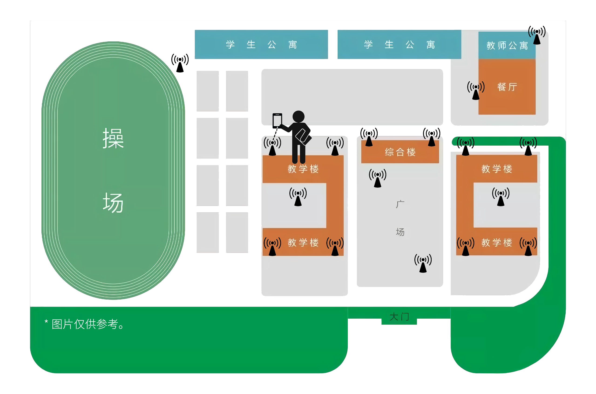
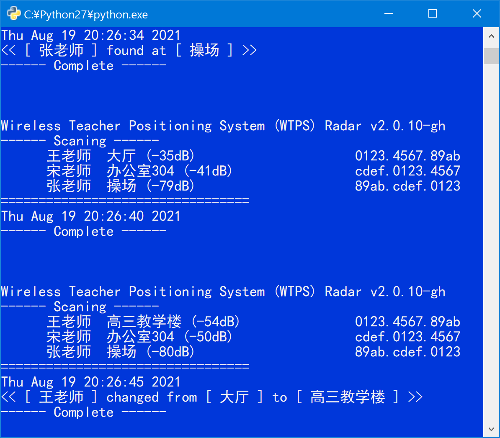

# WTPS
一个用于实时定位Z中教师所在位置的系统。

## WTPS是如何诞生的？
高中时期，我就读于Z中，中午有长达一个多小时的午间休息。

我向来是不睡午觉的。我要溜去基地（一间私自占用的空教室）使用电脑编程。

而校方有规定，午休期间不得离开班级教室。班主任、年级组长、学工办主任等人会不时做突击检查，非常危险。

于是，经过我一周的观察研究后，这个定位系统的雏形便诞生了。

## 工作原理
通过获取教师手机所连接的无线AP（即Wi-Fi基站，以下简称WAP），得到教师所在位置。

## 控制台报警
当WTPS检测到教师的位置发生变动时，控制台会从默认的黑底白字转为醒目的蓝底白字，并打印出为位置的变动情况。

报警期间控制台将处于强制前置状态，浮于所有窗口之上。

\* 此功能需要调用`cmdow.exe`，在macOS等系统下WTPS仅打印位置变动，而不会有醒目视觉提醒。有关`cmdow.exe`杀毒软件误报问题，请参照[此处](https://github.com/ritchielawrence/cmdow#is-cmdow-malware)。

## 运行环境
>考虑到便携性，WTPS不依赖任何第三方Python库。

解释器：Python 2.7
 
操作系统：Windows（推荐）／Android（使用QPython）／macOS／Linux

辅助工具：Cmdow (https://github.com/ritchielawrence/cmdow)

## 配置文件说明
>* 为了方便使用Windows内置的记事本直接修改配置文件，WTPS的配置文件均使用`GBK`编码。
>
>* 配置文件修改完成后，无需重启WTPS。WTPS会自动更新相关配置。

 文件          | 说明
 ------------- | ---------------------------------
 `place.json`  | 存放 *AP名* 与 *实际地点* 的对应关系
 `name.json`   | 存放 *用户名* 与 *教师姓名* 的对应关系
 `target.json` | 存放需要观察的 *教师姓名* 列表

## 服务端模拟说明
>* 该模拟服务端默认监听`127.0.0.1:9999`。
>
>* 进行模拟前，请先修改`wtps.py`的`LOGIN_URL`以及`CONF_URL`。

`server.py`用于模拟相关的实时环境。

该服务端共模拟了以下三位虚拟人物的相关行为：
* 王老师：从办公室到教室巡查，然后回到办公室；
* 宋老师：一直停留在办公室；
* 张老师：在操场跑步，信号不稳定。

## FAQ
### Q：这个系统的定位原理是？
### A：
><b>通过定位老师手机的位置，得知老师自身的位置。</b>
>
>基地的计算机和老师的手机同在一个局域网内。计算机通过有线方式接入，而老师的手机通过连接距离自身最近的WAP接入。
>
>Z中的WAP遍布整个校园，我们将每个WAP看做为一个定位点。如果A老师的手机与图书馆201室的WAP连接，那么他就处于图书馆201室附近。2.0版本中新增了RSSI信号强度显示，可以根据其信号强度大致判断教师距离定位点的远近程度。

### Q：如何知道某老师使用的是哪台手机？
### A：
><b>通过特定的时间地点，锁定老师手机。</b>
>
>该系统获得的仅仅是WAP代号和老师手机MAC地址的对应关系。在不接触老师手机的情况下，通常我们无法得知拥有某MAC地址的手机是属于哪位老师的。
>
>但是这个问题不难解决。例如，B老师某日下午三点在高二(4)班上课，那么通过翻查WTPS日志，当日下午三点连接在高二(4)班WAP的手机，即是B老师的手机。（因为在Z中，一般只有教师会连接Wi-Fi，只有他们才知道密码。）

### Q：如何得知老师要来巡查了？
### A：
><b>通过反复观察每日日志总结规律。</b>
>
>例如，年级组长C从“办公楼302”移动至“大厅3F”再移动至“高二教学楼”最终移动至“高二(4)班”，这就意味着他前来巡查了。那么在他移动的过程中，系统报警，我们便有足够的时间立即回到自己的教室。

### Q：WTPS的弊端有哪些？
### A：
>1. <b>教师未随身携带手机，WTPS将汇报错误的定位信息。</b>这种情况发生的可能性很小，但是产生的影响也是最严重的。假如教师巡查时，将手机落在了办公室，WTPS会误以为教师仍在办公室。
>
>2. <b>教师未连接学校Wi-Fi，WTPS将无法得知教师位置。</b>这种情况发生的可能性较小，因为手机流量费用高；并且使用手机流量，教师将无法访问到校内的内网资源。在这种情况下，WTPS将汇报该教师情况为`No data`。

### Q：为什么选择使用Python2？
### A：
><b>当时Python 2.7仍是主流版本。</b>
>
>我使用Python编程的时间比较长，此前一直使用Python 2.7编程。编写WTPS时，使用Python3的人并不多，我也仍在学习熟悉中。为了编程舒服顺手，我仍选择了老旧的Python2。

### Q：我也能使用该系统定位本校的老师吗？
### A：
><b>不一定行。</b>
>
>首先，我仍建议您遵守本校的相关规章制度。WTPS仅仅是针对锐捷AC设计的，在游客状态下获取WAP的相关连接信息。如果贵校使用的同是锐捷的产品，并且您已知晓无线AC的IP地址，您可以试一试作为WTPS可行性的验证。

### Q：那么开源WTPS的目的是？
### A：
><b>提供一种思路。并且提醒大家，当您连接公共Wi-Fi时，您的行迹有可能被追踪。</b>
>
>当我们连接公共Wi-Fi时，公共Wi-Fi大多会使用Web认证+短信验证码的方法，验证连接者的手机号。验证完成时，连接者的个人信息便与手机号绑定。当连接者停留在某类商店时间较长时，公共Wi-Fi提供商可能会向连接者的手机发送相关的推广短信。
